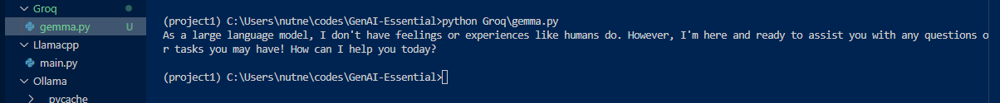
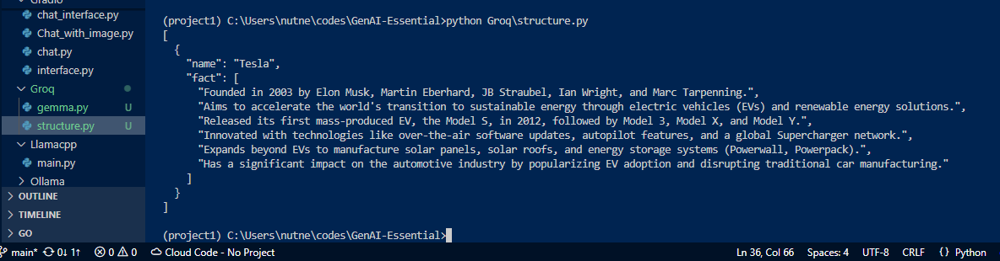

# Environment Setup

## Create an environment

```bash
conda create --name project1 python=3.13.5 -y
```

## Activate the environment

```bash
conda activate project1
```

## Install the requirements

```bash
conda install -c conda-forge pandas
```

```bash
pip install -r requirements.txt
```

## jupyter notebook necessities

If you get a missing module error trying to run jupyter, try 
```bash
conda install -c conda-forge ipykernel
```

## Install jupyterlab

```bash
conda install -c conda-forge jupyterlab
```

## Install jupyterlab extensions

```bash
conda install -c conda-forge jupyterlab-git
```

```bash
conda install -c conda-forge catppuccin-jupyterlab
```

## Run jupyterlab

```bash
jupyter lab --no-browser --allow-root --ip 0.0.0.0
```

## For working with AWS Bedrock

```bash
pip install boto3
```

## Requirements for Hugging Face

```bash
conda install -c conda-forge sentencepiece
```

```bash
pip install sacremoses
```

```bash
pip install hf_xet
```

## Llamafile
After downloading the file, add .exe to the end before working with it on windows.

## Llama.cpp

```bash
pip install llama-cpp-python
```

```bash
winget install llama.cpp
```

Download a model via:
https://huggingface.co/lmstudio-community/Llama-3.2-1B-Instruct-GGUF/tree/main

Then run in terminal:

```bash
llama-cli --hf-repo lmstudio-community/Llama-3.2-1B-Instruct-GGUF \
--hf-file Llama-3.2-1B-Instruct-Q3_K_L.gguf \
-p "You are a helpful assistant" -cnv
```

## Running linktree-clone

```bash
go mod init genai-essential
```

```bash
cd github-copilot\linktree-clone
```

```bash
go mod download github.com/gin-gonic/gin
go mod download github.com/joho/godotenv
go mod download gorm.io/driver/sqlite
go mod download gorm.io/gorm
```

```bash
go mod tidy
```

```bash
go build -o linktree-clone
```

```bash
set CGO_ENABLED=1
```

```bash
go run main.go
```

## For Amazon-q-developer 

 Install Amazon Q extension and follow the prompt to browser to create or logging into a builder's account.

Use WSL for the rest of the steps as follows:

### Go Project Setup (WSL with build-essential)

This project is a Linktree-style clone built in Go, using Gorilla Mux for routing and SQLite for persistence. Since the go-sqlite3 driver requires native compilation via CGo, we’ve shifted the development environment from Windows to WSL (Ubuntu) for smoother C compiler support.

#### System Requirements
WSL (Windows Subsystem for Linux)

Ubuntu/Debian inside WSL

Go (via sudo apt install golang-go)

#### Build tools:

```bash
sudo apt update
```

```bash
sudo apt install build-essential
```


#### Running the Project

Navigate to your project folder:

```bash
cd /mnt/c/Users/nutne/codes/GenAI-Essential/Amazon-q-developer/linktree-clone
```

Set CGO flag for native compilation:

```bash
export CGO_ENABLED=1
```

Run the Go server:

```bash
go run main.go
```

Hit the endpoint:


```bash
curl http://localhost:8000/profile
```

#### SQLite Schema Setup (one-time)

If your database isn’t initialized yet:

1. Open SQLite CLI from WSL:

```bash
sqlite3 profile.db
```

2. Create the Missing Table
```sql
CREATE TABLE profiles (name TEXT, bio TEXT, picture TEXT);
```

```sql
CREATE TABLE links (id INTEGER PRIMARY KEY AUTOINCREMENT, name TEXT, url TEXT);
```

3. Insert some starter data:
```sql
INSERT INTO profiles (name, bio, picture) VALUES ('Nutnell', 'Go dev and AI wrangler', 'profile.jpg');
``` 

4. Exit SQLite:

```sql
.quit
```
Add the extension SQlite Viewer to acess profile.db

## Cody 
Great for generating interfaces

## Gradio

```bash
pip install gradio
```

Run your python code to get a chat interface. Below are examples when you run:
 ```bash
 python chat.py
 ```

 

 ```bash
 python Chat_with_image.py
 ```


## Streamlit

### Install requirements

```bash
pip install streamlit
```

### Run 

```bash
streamlit run chat.py
```

The image generated is shown in the allocated section:


```bash
streamlit run hello.py
```


## FastHTML

### Install dependencies

```bash
pip install python-fasthtml
```

### Example

```bash
python chatgpt.py
```


## Groq

### Install requirements.

```bash
pip install groq
```

```bash
pip install instruct
```

### Example outputs

```bash
python gemma.py.py
```



```bash
python structure.py
```



## ai-worker for cloudflare

Navigate to the right directory

```bash
cd cloudflare
```

```bash
cd ai-workers
```

Install dependencies.

```bash
npm install -g wrangler
```

## Implementation of a vector store using PostgreSQL

### Running PostgreSQL via Docker containers.

#### Requirements

Docker desktop.
Dockerfile.
docker-compose.yml.
init.sql.

#### Running

```bash
docker compose up -d
```

After a successful build, Add a database connection using the PostgreSQL extension.

You can then run the rest of your code and make sure that the database correctly matches the one you just created.
